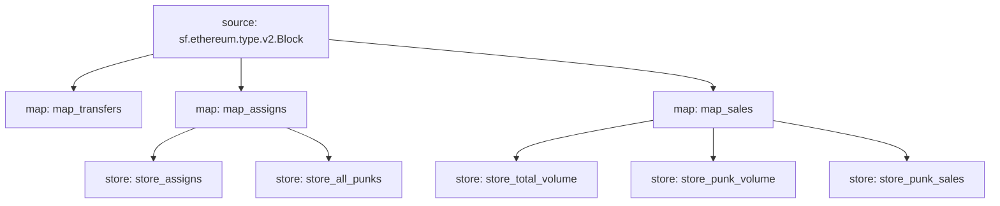

# Cryptopunks Substreams 

```mermaid
graph TD;
  map_transfers[map: map_transfers]
  sf.ethereum.type.v2.Block[source: sf.ethereum.type.v2.Block] --> map_transfers
  map_assigns[map: map_assigns]
  sf.ethereum.type.v2.Block[source: sf.ethereum.type.v2.Block] --> map_assigns
  store_assigns[store: store_assigns]
  map_assigns --> store_assigns
  store_all_punks[store: store_all_punks]
  map_assigns --> store_all_punks
  store_total_volume[store: store_total_volume]
  map_sales --> store_total_volume
  store_punk_volume[store: store_punk_volume]
  map_sales --> store_punk_volume
  store_punk_sales[store: store_punk_sales]
  map_sales --> store_punk_sales
  map_sales[map: map_sales]
  sf.ethereum.type.v2.Block[source: sf.ethereum.type.v2.Block] --> map_sales
```

