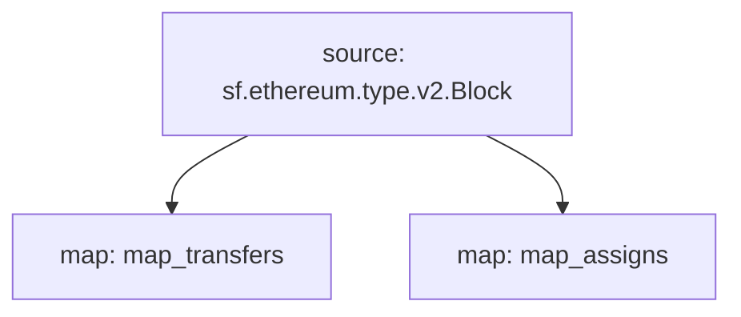

# Cryptopunks Substreams 

```mermaid
graph TD;
  map_transfers[map: map_transfers]
  sf.ethereum.type.v2.Block[source: sf.ethereum.type.v2.Block] --> map_transfers
  map_assigns[map: map_assigns]
  sf.ethereum.type.v2.Block[source: sf.ethereum.type.v2.Block] --> map_assigns
```

