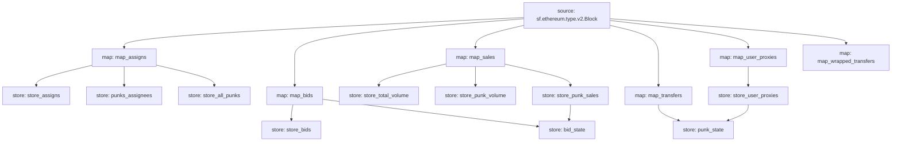

# Cryptopunks Substreams 

```mermaid
graph TD;
  map_assigns[map: map_assigns]
  sf.ethereum.type.v2.Block[source: sf.ethereum.type.v2.Block] --> map_assigns
  store_assigns[store: store_assigns]
  map_assigns --> store_assigns
  punks_assignees[store: punks_assignees]
  map_assigns --> punks_assignees
  map_bids[map: map_bids]
  sf.ethereum.type.v2.Block[source: sf.ethereum.type.v2.Block] --> map_bids
  store_bids[store: store_bids]
  map_bids --> store_bids
  bid_state[store: bid_state]
  map_bids --> bid_state
  store_punk_sales --> bid_state
  store_all_punks[store: store_all_punks]
  map_assigns --> store_all_punks
  store_total_volume[store: store_total_volume]
  map_sales --> store_total_volume
  store_punk_volume[store: store_punk_volume]
  map_sales --> store_punk_volume
  store_punk_sales[store: store_punk_sales]
  map_sales --> store_punk_sales
  map_sales[map: map_sales]
  sf.ethereum.type.v2.Block[source: sf.ethereum.type.v2.Block] --> map_sales
  map_transfers[map: map_transfers]
  sf.ethereum.type.v2.Block[source: sf.ethereum.type.v2.Block] --> map_transfers
  punk_state[store: punk_state]
  map_transfers --> punk_state
  store_user_proxies --> punk_state
  map_user_proxies[map: map_user_proxies]
  sf.ethereum.type.v2.Block[source: sf.ethereum.type.v2.Block] --> map_user_proxies
  map_wrapped_transfers[map: map_wrapped_transfers]
  sf.ethereum.type.v2.Block[source: sf.ethereum.type.v2.Block] --> map_wrapped_transfers
  store_user_proxies[store: store_user_proxies]
  map_user_proxies --> store_user_proxies
```